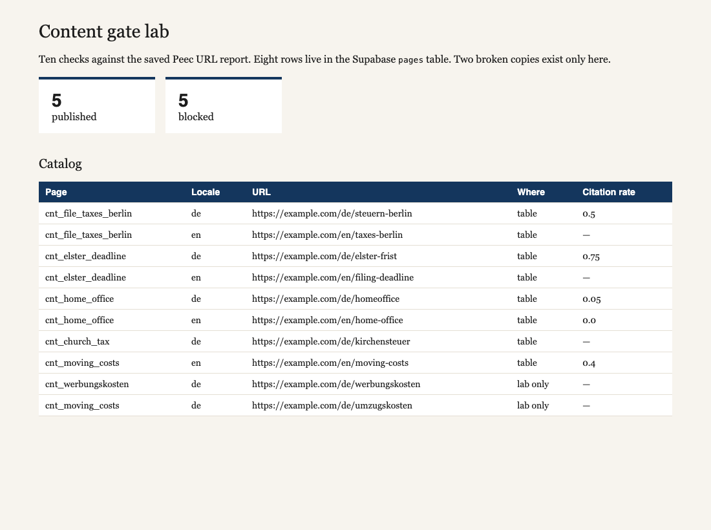
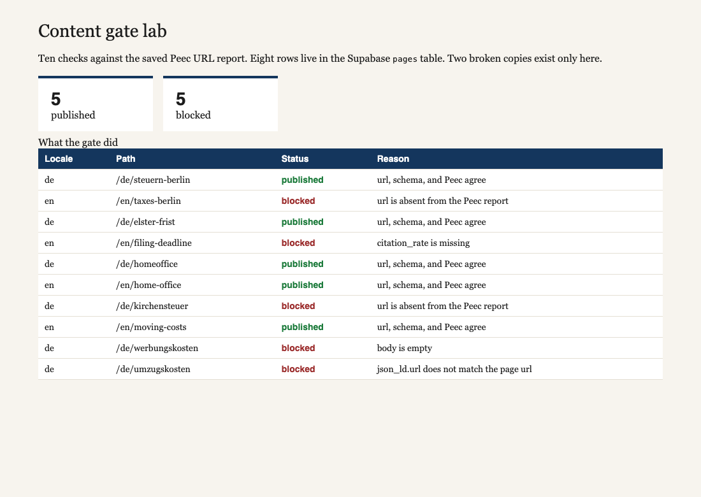

# Content gate

One article, two languages, one public URL per language. A check against Peec is written back onto that article. The page publishes only when the URL, the schema, and Peec agree.

Not a CMS. A JSON file stands in for one. Peec is the second system.

## Headline card

| Knob | Plain English |
| --- | --- |
| **`content_id`** | The page’s name inside this repo. |
| **`url`** | The public address. Peec and the page join on this. |
| **`locale`** | `de` or `en` of that same page. |
| **`PEEC_API_KEY`** | Peec password. Only for `--live`. Stays in `.env`. |
| **gate** | Refuses to publish when the page and Peec disagree. |

**System map:** `content/page.json` → Peec URL report or `fixtures/peec-urls.json` → compare on `url` → write `last_peec` onto the locale → `published` or `blocked`.

Full field list: `VARIABLE_SCHEMA.md`.

## Run

```bash
python3 -m venv .venv
source .venv/bin/activate
pip install -r requirements.txt
python gate.py --locale de
python gate.py --locale en
```

`de` is in the fixture, so it publishes. `en` is not, so it blocks. Both results are written into `content/page.json`.

Live Peec, after you copy `.env.example` to `.env` and add a key:

```bash
python gate.py --locale de --live
```

A company-scoped key also needs `PEEC_PROJECT_ID` (`or_…`). A project-scoped key does not. Docs: https://docs.peec.ai/api-reference/reports/get-urls-report

## Save the Supabase URL and key

From this folder, after the project exists:

```bash
npm run keys
```

It asks for the project URL, then the secret key. The key is masked. Both lines are written into `.env`. Do not paste the secret into chat.

## Lab

`python experiments.py` checks ten URLs against `fixtures/peec-urls.json`. It does not call Peec and does not change `content/page.json`.

Five publish. Five block. A low citation rate still publishes. A missing rate, an absent URL, an empty body, or a schema mismatch blocks.





Notes with the same shots: [docs/content-gate-lab.pdf](docs/content-gate-lab.pdf).

## Supabase

The eight real rows live in a `pages` table on a free project in Frankfurt. The gate still compares on `url`. Supabase stores the page. It does not produce the citation numbers. Those still come from the fixture, or from a Peec key if one exists later.

`npm run keys` writes `SUPABASE_URL` and `SUPABASE_SECRET_KEY` into `.env`. The secret is not committed.
