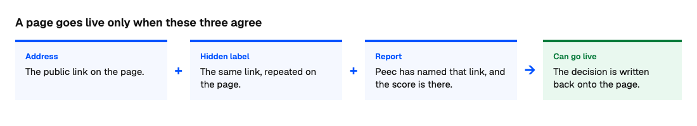
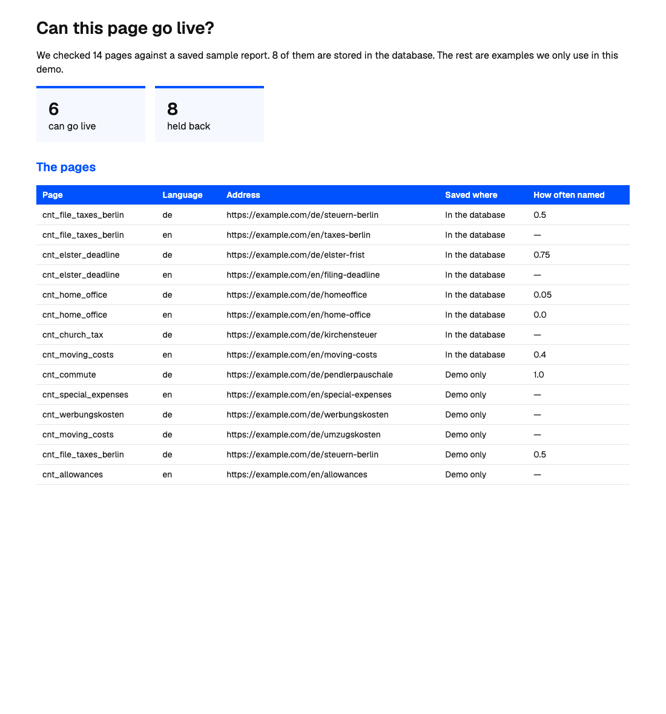
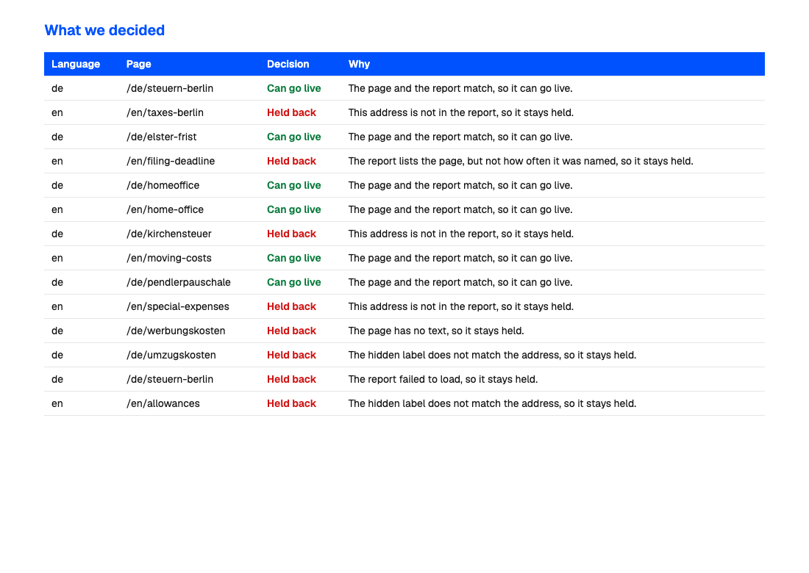

# Content gate

## The problem

Publishing a page is often a gut feel: someone hits “go live” without a clear check.

A page can show its own address and text. It **cannot** tell you whether an answer engine actually named that address. If you only trust the page, you can publish something that never showed up in the naming report — or block something for the wrong reason.

**What this program does:** it runs a small check. A page goes live only when three things agree:

1. the page’s public address  
2. a hidden label on the page that repeats that address  
3. a naming report (from Peec, or a saved sample for offline demos)

The decision is written back onto the page so anyone can see **can go live** or **held back**, and why.



## Who it helps

- Content / SEO / AEO people who want a clear publish rule, not a vibe  
- Engineers wiring “should this page ship?” into a pipeline or agent  
- Anyone evaluating Peec-style naming reports next to real page content  

No Peec account is required for the offline lab — a saved sample report is included.

## How to run

```bash
python3 -m venv .venv
source .venv/bin/activate
pip install -r requirements.txt
python gate.py --locale de
python gate.py --locale en
```

German is in the sample report → that page can go live. English is not → held back. Both decisions land in `content/page.json`.

**Bigger offline demo** (fourteen pages, no API calls):

```bash
python experiments.py
```

Six can go live; eight are held on purpose. Pictures + short note: [docs/content-gate-lab.pdf](docs/content-gate-lab.pdf).





### Optional: live Peec report

Copy `.env.example` to `.env`, add your Peec key, then:

```bash
python gate.py --locale de --live
```

Docs: https://docs.peec.ai/api-reference/reports/get-urls-report

### Optional: Supabase

After a Supabase project exists:

```bash
npm run keys
```

Saves the project address and password into `.env` (not uploaded to GitHub). Do not paste secrets into chat.

---

## What the words mean

| Word | What it means |
| --- | --- |
| **Page name** | Short name for one article. |
| **Address** | Public link — page and report are matched on this. |
| **Language** | German (`de`) or English (`en`). |
| **How often named** | Of the times the page was found, how often it was named. A low number does not stop the page. A **missing** number does. |
| **Hidden label** | Note on the page that must repeat the same address. |
| **Can go live** | Page and report match. |
| **Held back** | Something does not match — stays unpublished. |

Full field list: `VARIABLE_SCHEMA.md`.

## The database (optional deep dive)

Eight pages live in a `pages` table on a free Supabase project (Frankfurt). The database stores pages; it does not invent the report. Numbers still come from the saved sample (or a Peec key later).

`published` / `blocked` / `block_reason` / `last_peec` are written back onto those rows. Extra `articles` / `checks` views include dummy rows (`saved_where = Dummy`) for easier reading. The SQL function `apply_check` is in `supabase/apply_check.sql`.
